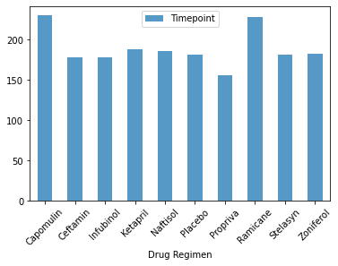
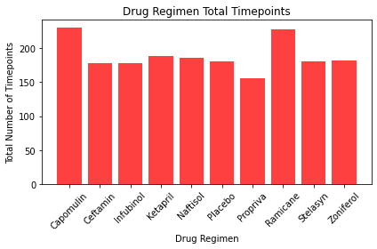
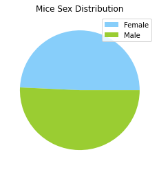
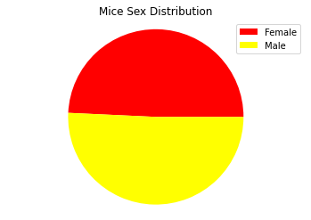

# Matplotlib: The Power of Plots

I used the complete data from recent animal study from Pymaceuticals Inc., a new pharmaceutical company that specializes in anti-cancer pharmaceuticals. Recently, it began screening for potential treatments for squamous cell carcinoma (SCC), a commonly occurring form of skin cancer.

In this study, 249 mice identified with SCC tumor growth were treated with a variety of drug regimens. Over the course of 45 days, tumor development was observed and measured. The purpose of this study was to compare the performance of Pymaceuticals' drug of interest, Capomulin, versus the other treatment regimens. 

I generagted all of the tables and figures needed for the technical report of the study. Including a top-level summary of the study results.

### Steps taken

* #### Prepare the data.

    * Before data cleaning: 1893 rows and 249 number of unique Mous IDs
 
      * 
 
     * After data cleaning:  1888 rows and 249 number of unique Mous IDs
     
       * 

## Summary statistics
**Two summary statistics DataFrames:**

First table using the `groupby` method to generate the mean, median, variance, standard deviation, and SEM of the tumor volume for each drug regimen. This resulted in five unique series objects which was combined into a single summary statistics DataFrames:
 
  * 
  
Second table using the `agg` method to produce the same summary statistics table by using a single line of code:

  * 

## Bar charts showing the total number of timepoints for all mice tested for each drug regimen:

<table>
  <tr>
    <td>Using Pandas`DataFrame.plot()` method</td>
     <td>Using Matplotlib's `pyplot` methods</td>
  </tr>
  <tr>
    <td></td>
    <td></td>
  </tr>
 </table>
   

## Pie charts showing the distribution of female versus male mice:
<table>
  <tr>
    <td>Using Pandas`DataFrame.plot()` method</td>
     <td>Using Matplotlib's `pyplot` methods</td>
  </tr>
  <tr>
    <td></td>
    <td></td>
  </tr>
 </table>

# Statistical Analysis
I calculated the final tumor volume of each mouse across four of the most promising treatment regimens: Capomulin, Ramicane, Infubinol, and Ceftamin. Then, I calculated the quartiles and IQR and determine if there are any potential outliers across all four treatment regimens:

## Calculating Quartiles, Finding Outliers and plotting the results

* Box plot of the final tumor volume of each mouse across four regimens of interest.

* Line plot

* Scatter plot

* Calculating correlation and regression. 

# Analysis 

### Observations and Insights
Using Panda and Matplotlib I investigated the two datasets after merging them into one PandDataframe and then cleaning the data. After plotting and calculating this data I have concluded that:

* There is somewhat of a medium correlation between the Tumor Volume and Weight, further plotting them reveals that there is no clear correlation between them

* Out of the six outliers 5 are female and only 1 is male. Of these 5 females, 4 are considerable younger than the other 2 mice. And these 4 are under the following Drug Regimen
  - Propriva x 2(both are above the upper_bound of tumor volume)
  - Capomulin x 2(both are below lower_bound of tumor volume) 

* There is an even distribution of male vs female mice

* Ramicane and Capomulin have the heighest total number of timpoints
Capomulin may have the best result but that would need investigating further.
